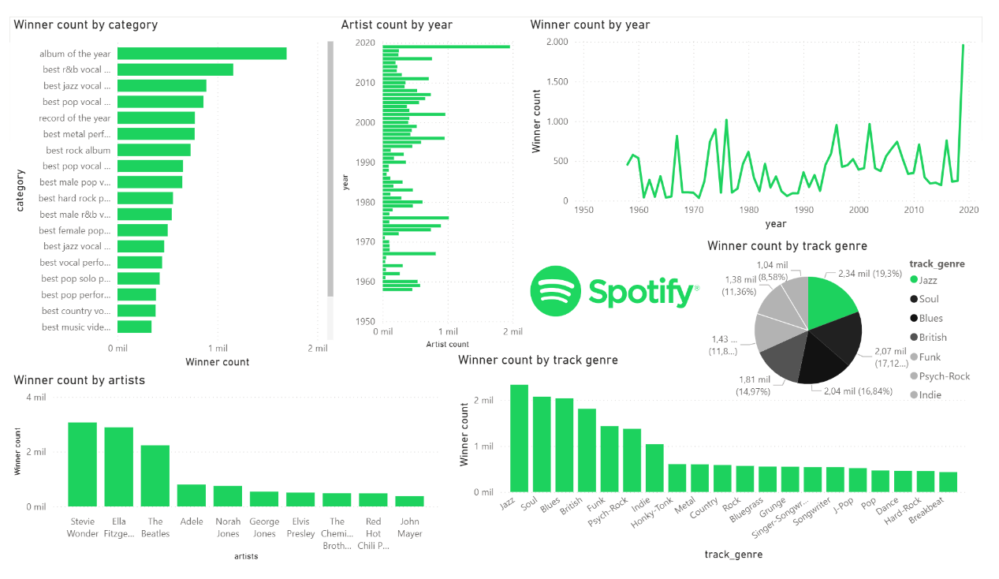

# workshop2_ETL


# Grammy & Spotify Data ETL Pipeline

This project is an ETL (Extract, Transform, Load) pipeline that processes data related to Grammy Awards and Spotify tracks. The project is developed using Python and `pandas` for data manipulation, with data being stored in a PostgreSQL database. The project also includes DAGs managed by Apache Airflow to automate the ETL process.

## Technologies used

**Jupyter:** manipulation and transformation of all data.

**Airflow:** Data flows for the ETL of the project.

**Power BI:** Data visualizations.

**Drive:** Platform to save a copy of the information.

**PosgresSQL:** Database to store the data.


## Installation

### 1. Clone the repository

```bash
git clone https://github.com/juank218/workshop2_ETL.git
cd workshop2_ETL
```

### 2. Set up a virtual environment using `venv`

If you don't have `venv` installed, follow the instructions [here](https://docs.python.org/3/library/venv.html).

1. Create the virtual environment:
    ```bash
    python3 -m venv venv
    ```
    
2. Activate the virtual environment:
    - On macOS/Linux:
        ```bash
        source venv/bin/activate
        ```
        
    - On Windows:
        ```bash
        venv\Scripts\activate
        ```
        

### 3. Install the required dependencies

Make sure you have the virtual environment activated before running this command:

```bash
pip install -r requirements.txt
```


1. Update your `.env` file with your PostgreSQL connection details:

```makefile
DB_USERNAME=your_username
DB_PASSWORD=your_password
DB_HOST=""
DB_PORT=""
DB_NAME=""

```

## Usage

### 1. Running the ETL pipeline

You can trigger the ETL pipeline through Airflow. Make sure your Airflow instance is running and that the DAGs are loaded.

1. **Start Airflow** (in the terminal):
    
    ```bash
    export AIRFLOW_HOME=$(pwd)/airflow
    AIRFLOW_VERSION=2.10.1
    PYTHON_VERSION="$(python -c 'import sys; print(f"{sys.version_info.major}.{sys.version_info.minor}")')"
    CONSTRAINT_URL="https://raw.githubusercontent.com/apache/airflow/constraints-${AIRFLOW_VERSION}/constraints-${PYTHON_VERSION}.txt"
    pip install "apache-airflow==${AIRFLOW_VERSION}" --constraint "${CONSTRAINT_URL}"
    airflow standalone
    ```

Then enter the browser and paste the link:

```bash
localhost:8080
```

2. Access Airflow by visiting `http://localhost:8080` in your browser.
3. Trigger the ETL DAGs from the Airflow UI.


# Dashboard 

